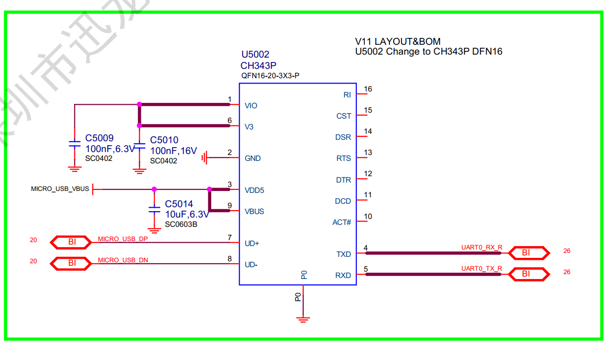
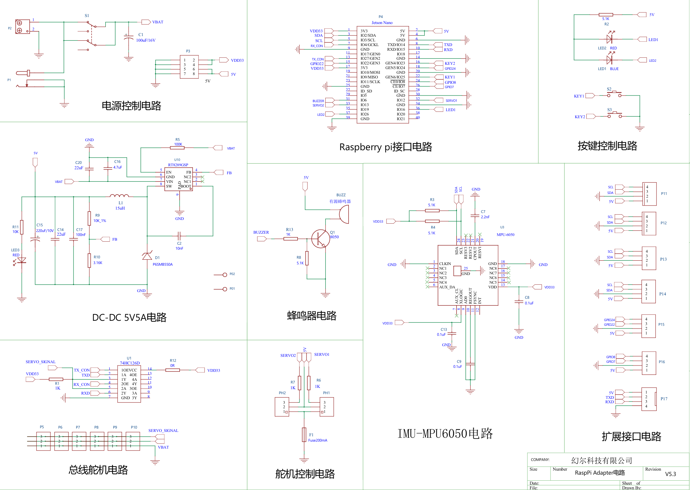

# 硬件部暑培课程大纲

## 前置：Copilot必备！

[常见登不上去的情况](https://zhuanlan.zhihu.com/p/1908234855482889076)

【安装网络问题】pip install opencv-python --trusted-host pypi.tuna.tsinghua.edu.cn --trusted-host files.pythonhosted.org --trusted-host pypi.org

## 7.7 电路板识读30min

### OrangePi AIpro 20T开发板

  1. ​​核心特点​​
  - ​​双线制​​：仅需两根信号线：
  - ​SCL​​（Serial Clock Line）：时钟线，由主设备控制时序
  - ​​SDA​​（Serial Data Line）：数据线，双向传输数据。
  - ​​主从架构​​：支持多主多从模式，通过唯一地址（7位或10位）寻址从设备
  - ​​同步半双工​​：同一时间只能单向传输数据，依赖时钟同步
  - ​​开漏输出​​：总线需接上拉电阻，避免信号冲突，实现“线与”逻辑
  
  2. ​​典型应用场景​​
  - 传感器（如温度传感器、加速度计）
  - 存储器（如EEPROM）
  - 显示模块（如OLED、LCD）
  - 实时时钟（RTC）模块
  
  3. ​​与其他协议的对比​​
  - ​与SPI​​：I2C引脚更少（2线 vs. 4线），但速率较低（标准模式100 kbit/s，高速模式3.4 Mbit/s）。
  - ​与UART​​：I2C支持多设备寻址，而UART仅支持点对点通信。
  
  1. 总结：I2C是一种简洁高效的串行通信标准，因其硬件成本低、扩展性强，成为嵌入式系统和物联网设备的首选协议之一。其名称的正确读法和全称体现了其设计初衷——实现集成电路间的互联通和数据交换

- 复位键（Reset）​​：直接触发硬件复位电路，重启CPU但不完全断电，适用于系统崩溃恢复

- 物理按键作用​​：关机键通常是一个瞬时开关（非自锁开关），按下时短接电路，向主板发送低电平或高电平信号。主板上的电源管理芯片（如Intel的ICH或AMD的FCH）检测到该信号后，会生成中断请求（IRQ）
 
- ​长按与短按的区别​​：
  - ​短按​​：发送“软关机”信号（如ACPI的PWRBTN#信号），通知操作系统正常关机流程
  - ​长按（4秒以上）​​：直接触发硬断电（强制关机），绕过操作系统，由电源管理芯片切断主板供电

实际20T板子用type-C，大致是一样的

Micro-USB接口电路​​
- 引脚定义​​：
  - VBUS：USB 5V电源输入，为CH343P供电
  - D+/D-：USB差分数据线，连接CH343P的UD+和UD-
- ​滤波与保护​​：
  - ​电容​​：C5009、C5010（100nF）用于高频噪声滤波；C5014（10μF）为电源稳压电容
  - ​电阻​​：图中标注的2.2k和3.33k电阻可能用于USB数据线阻抗匹配或上拉

死机、无法启动时考虑充电宝电压不足问题；电池电压影响小车运动——建议使用65W快充充电宝

### 扩展板

- 字母前缀的含义​​
  - ​​U​​：代表集成电路（IC）或芯片（如 ​​U5​​ 表示第5个IC）
  - ​​R​​：代表电阻（如 ​​R10​​ 表示第10个电阻）
  - ​C​​：电容
  - ​L​​：电感
  - ​D​​：二极管
  - ​Q​​：三极管/MOSFET
  - ​​J​​：连接器
- 电源控制电路
- 接口电路，关注356，共地很重要
- DC-DC 5V5A电路，降压电路，因为电池是3.7V*2
- 蜂鸣器电路——有源+三极管放大
- IMU-MPU6050电路：
  - MPU6050集成了 ​​三轴加速度计​​ 和 ​​三轴陀螺仪​​，通过MEMS技术测量物体的线性加速度和旋转角速度，并内置数字运动处理器（DMP）进行数据融合，输出姿态信息
  - ​​加速度计​​：基于电容式检测原理，测量X/Y/Z轴的加速度（包括重力分量）
  - ​陀螺仪​​：利用科里奥利力效应，检测绕三轴的角速度
  - ​DMP​​：硬件级数据处理模块，可减轻主控计算负担，直接输出四元数或欧拉角
- 舵机控制电路
  - (1) 核心控制信号（PWM）​​
    - ​​图中接口​​：PH1、PH2 为PWM信号输入接口，连接主控（如单片机）的GPIO引脚
      - ​周期​​：20ms（50Hz），对应电路中的电阻（R6、R7）可能用于信号限流或电平匹配
      - 脉冲宽度​​：0.5ms~2.5ms，控制舵机角度（如1.5ms对应90°）
  - (2) 电源管理​​
    - ​​5V供电​​：直接为舵机（SERVO1、SERVO2）提供动力电源，图中标注清晰
    - ​保险丝F1（200mA）​​：保护电路，防止舵机堵转时电流过载（舵机工作电流通常100~500mA）
  - ​(3) 信号调理电路​​
    - ​电阻R6、R7（1KΩ）​​可能作用：
    - 限流：防止主控GPIO引脚过流
    - 上拉/下拉：确保信号稳定性（需结合主控输出类型判断）
    - 典型场景：若主控为3.3V电平，1KΩ电阻可减少舵机（5V逻辑）的信号干扰
- 总线舵机电路核心芯片：74HC126D​​
  - ​​功能​​：四路三态缓冲器（带使能控制），用于信号隔离和电平转换
  - ​​关键引脚连接​​：
    - ​​VCC（10脚）​​：接3.3V（VDD33），为芯片供电
    - ​​GND（7脚）​​：系统共地
    - 使能端（4OE/2OE/3OE）​​：控制对应通道的缓冲器开关（图中未标注连接，可能由主控GPIO控制）
  - ​信号通道​​：
    - 1A→1Y（绿色SERVO_SIGNAL输入，经缓冲后输出至总线）
    - ​​P5-P10端口​​：连接多个舵机，共享SERVO_SIGNAL信号